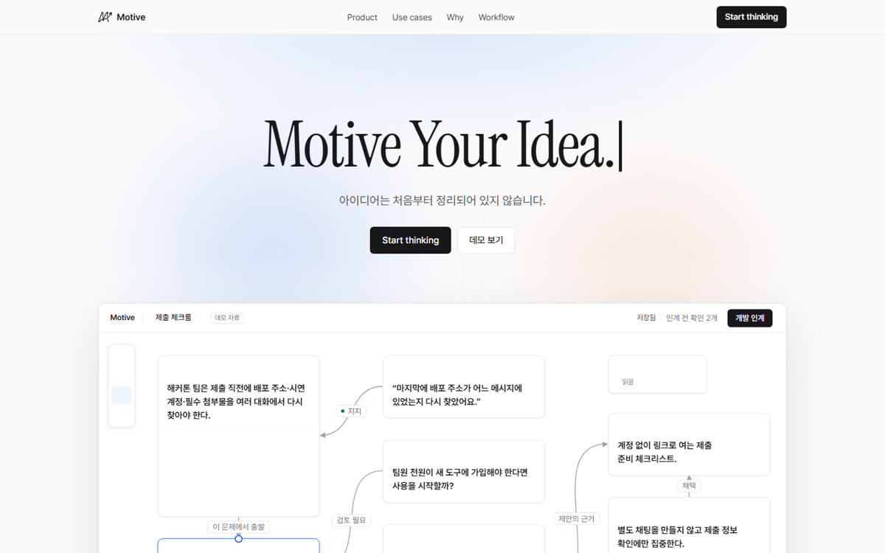

<p align="center">
  
</p>

<h1 align="center">Motive</h1>

<p align="center">
  <b>Motive Your Idea.</b><br/>
  아이디어는 처음부터 정리되어 있지 않습니다.<br/>
  문제 · 가설 · 근거 · 결정을 한 캔버스에 두고, <i>왜 생각이 바뀌었는지</i>까지 코딩 에이전트에게 넘기는 워크스페이스.
</p>

<p align="center">
  <a href="https://motive-it.vercel.app"></a>
  <a href="https://motive-it.vercel.app/dashboard"></a>
  
  
</p>

<p align="center">
  
</p>

---

## 왜 Motive인가

> **Thinking became non-linear. Our tools didn't.**

| 지금 쓰는 도구 | 문제 |
|---|---|
| 채팅 (Slack · 카톡 · ChatGPT) | 어제 왜 그렇게 판단했는지는 스크롤 어딘가에 있다. |
| 문서 (Notion · Docs) | 무엇이 불확실한지 알기 전에 목차부터 정한다. 버린 가설은 적히지 않는다. |
| 화이트보드 (Figma · Miro) | 포스트잇은 사람만 읽는다. 에이전트에 넘기려면 누군가 처음부터 다시 쓴다. |

Motive는 **문서가 아니라 과정**을 남깁니다. 문제 · 가설 · 근거 · 검토 질문 · 해결안 · 결정이 카드로 남고, 카드 사이의 관계가 맥락이 됩니다. 그 맥락은 `PROJECT_HANDOFF.md` 한 장으로 Claude Code · Codex에 그대로 붙여넣을 수 있습니다.

> **Don't give AI the answer. Give it the context.**

---

## 핵심 기능

### 🗂 관계가 있는 캔버스
- 카드 8종 — `P` 문제 · `H` 가설 · `E` 근거 · `C` 검토 질문 · `S` 해결안 · `D` 결정 · `R` 요구사항 · `N` 메모
- 관계 11종 — 이 문제에서 출발 · 검토 필요 · 지지 · **반대 근거** · 제안의 근거 · 채택 · 보류 · 기각 · 구현 범위 · 관련 · 연결
- 카드 변의 손잡이를 끌어 잇고, 선을 눌러 관계를 바꿉니다. 채택/보류/기각은 해결안 상태까지 바꿉니다.
- 정리(관계 기준 격자) · 집중 보기 · 관계선 숨기기 · 범위 선택 · 되돌리기 · 10 ~ 400 % 줌 · 트랙패드 제스처

### 📎 자료에서 근거 뽑기
- Markdown · PDF · 텍스트 · 이미지 · URL을 캔버스에 놓으면 **자료 카드**가 됩니다. 카드에 놓으면 그 카드 옆에 붙습니다.
- AI가 원문에서 **줄 번호가 붙은 인용**을 후보로 뽑고, 사람이 어느 카드에 어떤 관계로 붙일지 **승인**합니다.
- 인용은 원문과 대조되며, 원문에 없는 문장은 추가할 수 없습니다. 근거는 언제나 출처에 닿습니다.

### ⚖️ 어긋남을 숨기지 않기
- 채택한 해결안에 반대 근거가 붙으면 **어긋남**으로 표시됩니다 — 결정을 되돌리거나, 근거를 기각하거나, 알고 진행하거나.
- 어느 쪽을 택했든 인계 문서에 그대로 남습니다.

### 📦 에이전트 인계
- `PROJECT_HANDOFF.md` 미리보기 + `PROJECT_CONTEXT.md` · `DECISIONS.md` · `EVIDENCE.md` · `AGENTS.md` 다운로드
- 기각한 대안 · 미검증 가설 · 열린 질문 · 반대 근거 · 재검토 조건이 **그대로** 들어갑니다. 상태를 꾸미지 않습니다.

### 🧭 3분 데모 체험
- 한 팀의 리서치 자료 5개(인터뷰 · 경쟁 조사 · 설문 · 실험 · 회의록)로 **근거 뽑기 → 가설 반박 → 문제 재정의 → 결정 → 인계**를 따라갑니다.
- 안내 카드가 다음 한 걸음만 가리키고, 지금 눌러야 할 곳이 파란 테두리로 깜빡입니다. 언제든 숨기고, 처음부터 다시 할 수 있습니다.

---

## AI는 어디에서, 어디까지

| 기능 | 하는 일 | 하지 않는 일 |
|---|---|---|
| 문제 다듬기 | 대상 · 상황 · 불편이 드러나게 문장을 정리하고, **빠진 요소를 알려줌** | 없는 맥락을 지어내지 않음 |
| 근거 뽑기 | 원문에서 카드와 관련된 인용 후보 ≤ 5개 (인용 · 해석 · 한계 · 관계) | 근거를 자동 확정하지 않음 |
| 자료 요약 | 올릴 때 1~2문장 요약 + 요점 3개 | 원문을 대체하지 않음 |

모든 AI 출력은 **제안**이고, 사람이 승인해야 그래프에 들어갑니다. 키가 없어도 작성 · 연결 · 결정 · 인계는 전부 동작합니다.

---

## 시작하기

```bash
git clone https://github.com/iamnotfemale/motive.git
cd motive
npm install
cp .env.example .env.local   # OPENROUTER_API_KEY 채우기 (선택)
npm run dev                  # http://localhost:3000
```

| 환경변수 | 설명 |
|---|---|
| `OPENROUTER_API_KEY` | OpenRouter 키. 없으면 AI 기능만 꺼지고 나머지는 그대로 동작 |
| `MOTIVE_MODEL` | 모델 ID. 기본 `deepseek/deepseek-v4-flash-0731:free` |

```bash
npm run check   # 파서 · 배치 · 이슈 검출 · 내보내기 · 스토어 · 체험 흐름 자체 검사
npm run build
```

데이터는 브라우저 `localStorage`에만 저장됩니다 (가입 없음). `대시보드 → 설정`에서 JSON 백업 · 복원 · 초기화.

---

## 구조

```
app/
  page.tsx               소개 페이지
  dashboard/             캔버스 목록 · 파일 · 휴지통 · 설정
  think/[id]/            캔버스 · 인계 문서
  api/ai/                문제 다듬기 · 근거 뽑기 · 요약 (OpenRouter)
components/
  canvas/                카드 · 선 · 자료 칩 · 선택 도구 막대
  panels/                검토(근거 뽑기) · 결정 · 자료 · 검사기 · 이슈
  TutorialGuide.tsx      3분 체험 안내
lib/
  store.ts               zustand + persist. 프로젝트 · 카드 · 관계 · 자료 · 되돌리기
  labels.ts              내부 타입 ↔ 한국어 라벨의 유일한 지점
  issues.ts              인계 전 확인 · 어긋남 검출
  export.ts              그래프 → 인계 문서 4종
  tidy.ts                관계 기준 격자 배치
  tutorial.ts            체험 씨앗 · 미리 정한 근거 후보 · 단계 계산
docs/                    제품 스펙 · 디자인 핸드오프 · 토큰
```

**스택** — Next.js 16 · React 19 · TypeScript · Tailwind v4 · zustand · Radix/shadcn · motion · Vercel AI SDK + OpenRouter · pdf.js

---

## 원칙

1. **AI는 제안만 한다.** 근거 · 관계 · 결정을 자동으로 확정하지 않는다.
2. **상태를 꾸미지 않는다.** 미검증은 미검증으로, 열린 질문은 열린 채로 내보낸다.
3. **버린 길도 남긴다.** 기각한 대안과 이유가 있어야 에이전트가 같은 제안을 다시 하지 않는다.
4. **출처는 줄 번호까지.** 모든 근거가 원문에 닿아야 한다.
5. **가입 없이, 브라우저에.** 문제를 적는 순간부터 인계까지 한 곳에서.

---

<p align="center">
  <sub>Built for GDG on Campus Hackathon 2026 · <a href="https://motive-it.vercel.app">motive-it.vercel.app</a></sub>
</p>
